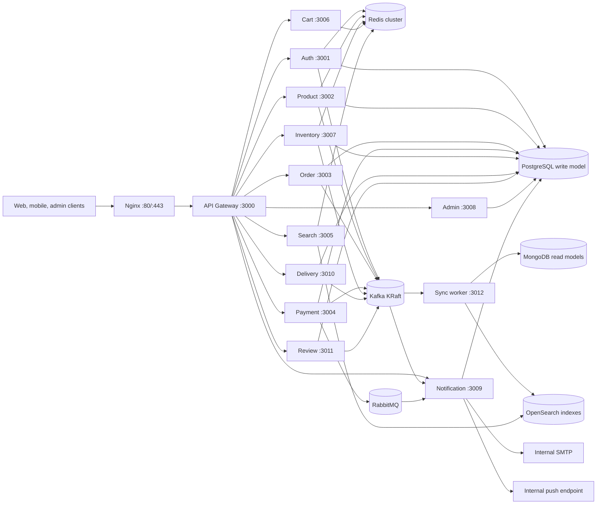
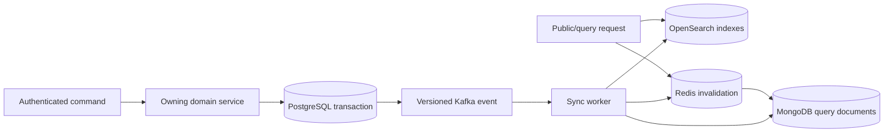
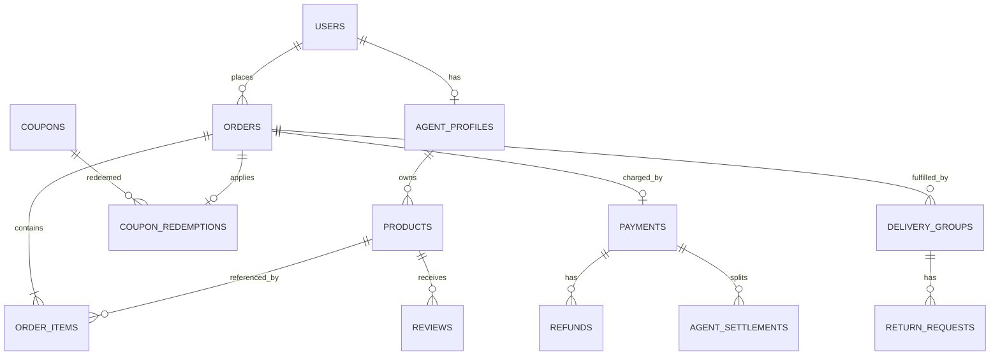

# System architecture

This document is the architecture source of truth for the native, offline
deployment. Runtime ports and host-level installation details are defined in
[`offline-infrastructure.md`](./offline-infrastructure.md); the generated HTTP
contract is [`openapi.json`](./openapi.json).

## Service map

Only Nginx is exposed to client networks. Service, database, broker, metrics,
and tracing ports remain on trusted application/data networks.

## Seven bounded contexts

| Context | Responsibilities | Owning processes | Authoritative state |
| --- | --- | --- | --- |
| 1. Identity and access | Accounts, sessions, agent applications, roles and approval | Auth service, RBAC package | PostgreSQL `auth`, Redis sessions |
| 2. Catalog and discovery | Product lifecycle, reviews, public search and autocomplete | Product, review, search services | PostgreSQL `product` and `review`; MongoDB/OpenSearch projections; Redis cache |
| 3. Commerce | Cart, order pricing, coupons, order state and saga coordination | Cart and order services | Redis carts; PostgreSQL `order` |
| 4. Inventory | Available/reserved stock, atomic reservation, release and restock | Inventory service | PostgreSQL `inventory`, Redis atomic stock state |
| 5. Payments and settlement | Charges, refunds, seller commission, settlement and clawback | Payment service | PostgreSQL `payment`; external/internal PG adapter |
| 6. Fulfilment | Seller shipping policy, delivery groups, tracking, receipt and returns | Delivery service | PostgreSQL `delivery` |
| 7. Platform operations | Administration, notifications, CQRS projection, audit and observability | Admin, notification and sync-worker processes | PostgreSQL `admin`/`notification`, local logs and metrics |

Contexts exchange immutable, versioned events. A context may read another
context through a narrow internal HTTP endpoint when synchronous validation is
required, but it must not mutate another context's tables.

## Role and trust boundaries

| Capability | user | approved agent | admin | super-admin |
| --- | :---: | :---: | :---: | :---: |
| Browse and purchase | yes | yes | yes | yes |
| Manage owned products, inventory and delivery groups | no | yes | override | override |
| Moderate products and agent applications | no | no | yes | yes |
| Issue refunds and manage orders | no | no | yes | yes |
| Manage users and view operational reports | no | no | yes | yes |
| Create admins, change privileged roles, audit and settlement control | no | no | no | yes |

The gateway validates JWTs and replaces all caller-supplied identity headers.
Downstream services authorize the sanitized `x-user-id`, `x-user-role`, and
`x-agent-id` context with the shared RBAC package. Internal-only routes also
require `x-internal-service-token`. Agent ownership is checked against the
agent-profile claim rather than the account ID.

## Write and read models

- PostgreSQL is authoritative for users, products, orders, coupons, payments,
  inventory, delivery, reviews, notifications and audit history.
- Redis holds revocable sessions, carts, rate-limit counters, locks, atomic
  stock state, autocomplete data and disposable cache entries.
- MongoDB and OpenSearch are rebuildable projections. They never authorize a
  mutation or settle money.
- Kafka consumers commit offsets only after their database/projection work
  succeeds. Poison messages move to a bounded DLQ after retries.

## Core relational ownership

Cross-schema IDs deliberately avoid database-level foreign keys where service
deployment order or ownership would be coupled. The owning service validates
those references before writing. Local aggregate relationships use foreign
keys and transaction boundaries.

## Messaging topology

Kafka carries durable domain facts:

- Identity: registration and agent approval.
- Catalog: product create/update/delete and rating projection changes.
- Commerce: order create/confirm/pay/cancel/complete and status changes.
- Inventory: reservation success/failure and stock updates.
- Payments: payment completion/failure/refund and seller settlements.
- Fulfilment: delivery group creation/shipping/completion and returns.
- Operations: low-stock, delayed-delivery and system-health warnings.

Partition keys use the aggregate or saga ID so transitions for one aggregate
remain ordered. Event envelopes include `eventId`, `occurredAt`, `version`,
`topic`, and `payload`; consumers must tolerate replay.

RabbitMQ is reserved for task-style notification delivery. Exchanges, queues,
retry routing and dead-letter routing are declared by `infra/rabbitmq/setup.sh`.
Acknowledgement occurs only after delivery or confirmed retry publication.

## Transaction and failure rules

1. Monetary values are integer KRW. Coupon discounts are allocated exactly to
   order lines; the sum of seller settlement gross amounts equals the captured
   payment amount.
2. Client mutation keys are scoped to the authenticated actor. A replay with a
   changed payload is rejected; an exact replay repairs downstream publication.
3. Coupon rows are locked while validating time, global and per-user limits.
   Order, redemption and usage count commit atomically.
4. Inventory reservation and release use Redis Lua scripts and persistent
   PostgreSQL outcomes to prevent overselling and late-event resurrection.
5. Gateway timeouts do not convert unknown payment outcomes to failure. The
   same gateway idempotency key is reused for reconciliation.
6. Readiness is dependency-aware. Nginx and the gateway must not route traffic
   to a process whose required stores or brokers are unavailable.
7. Review mutations enqueue the absolute product-rating projection in the same
   PostgreSQL transaction. The review outbox retries Kafka publication with a
   stable event ID and deletes work only after the broker confirms it.

## Deployment topology

The supported deployment is native Linux with PM2/systemd and no container
runtime. `ecosystem.config.js` defines application processes; `infra/systemd`,
`infra/nginx`, `infra/prometheus`, `infra/grafana`, and `infra/jaeger` define
host services. Installation sequence, ports, firewall rules, TLS and offline
package transfer are documented in `offline-infrastructure.md`.
